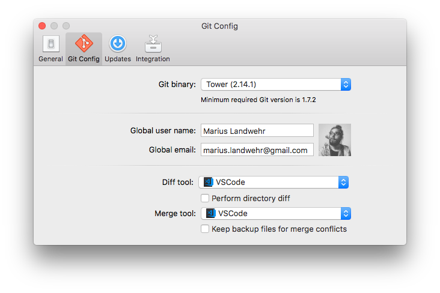

# Tower Visual Studio Code Diff Support
You would like to support Visual Studio Code for diffing and mergin your files? Awesome, it's easy as pie with these steps.

## Requirements
[Visual Studio Code Command Line Tooles must be installed](https://code.visualstudio.com/docs/setup/mac)

## Installation
```bash
mkdir -p ~/Library/Application Support/com.fournova.Tower2/CompareTools/
cp Compare\ Tools/* ~/Library/Application Support/com.fournova.Tower2/CompareTools/
```
## Configurate Git Tower
1. Settings
2. Git Config
3. Select VSCode

